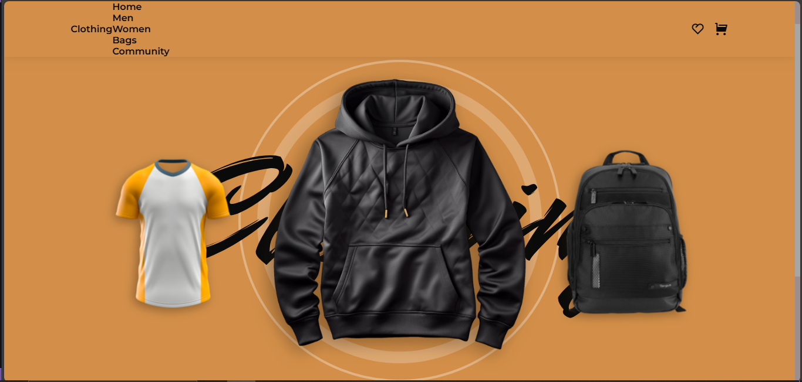

# 👗 Responsive Clothing Website

A modern, responsive clothing website built with **HTML, CSS, and JavaScript**, featuring smooth animations and interactive components powered by **Swiper.js** and **ScrollReveal**.

---

## ✨ Features

- 📱 **Responsive Design** — Works seamlessly across desktop, tablet, and mobile devices.
- 🎨 **Modern UI/UX** — Clean layout with intuitive navigation.
- 🖼️ **Image Slider** — Product showcases using **Swiper.js**.
- 🌟 **Scroll Animations** — Engaging reveal effects with **ScrollReveal.js**.
- 🛍️ **Clothing Catalog** — Organized sections for men’s, women’s, and accessories.
- ⚡ **Fast & Lightweight** — Pure HTML, CSS, and vanilla JavaScript.

---

## 🚀 Demo

👉 [Live Demo](#) *(Add your deployed link here)*

---

## 🛠️ Tech Stack

| Technology   | Purpose                          |
|--------------|----------------------------------|
| HTML5        | Structure of the website         |
| CSS3         | Styling and responsive design    |
| JavaScript   | Interactivity and logic          |
| Swiper.js    | Product sliders & carousels      |
| ScrollReveal | Scroll-based animations          |

---

